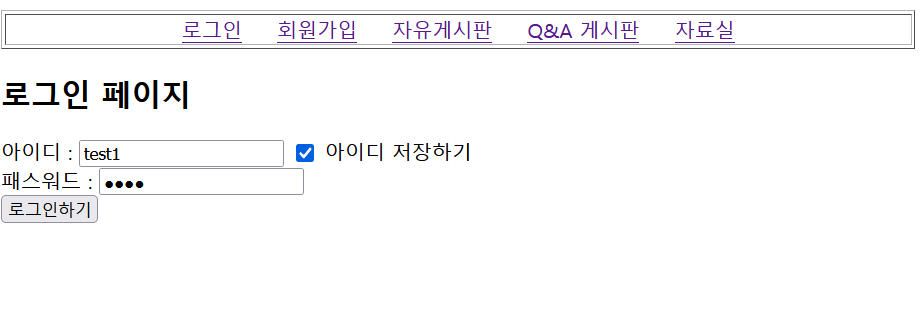

# 📝 JSP Servlet을 이용한 개인 프로젝트
---
회원제 게시판 프로젝트입니다.  
 
 
 
## 💻 개발 기간
---
- 🗓 2024.11.14 ~ 2024.11.21
 
 
 
## 🛠 개발 환경
---
- ☕ **언어**: Java  
- 📦 **JDK 버전**: Java SE 21  
- 🖥️ **개발 도구(IDE)**: Eclipse IDE for Enterprise Java (JEE 2024-09)  
- 🎨 **프론트엔드**: JSP  
- 🔧 **백엔드**: Servlet  
- 🗄️ **데이터베이스**: Oracle DB 11xe  
- 🚀 **서버**: Apache Tomcat 10.1  
 
 
 
## ⚙️ 기능 설명
---
- 🔐 **로그인**: (아이디, 비밀번호 / 로그인 시 아이디 저장)  
- 🆕 **회원가입**: (아이디 중복확인, 비밀번호 가림 처리 및 확인, 이메일 형식 체크)  
- ✍️ **회원정보수정**: (아이디, 이름 제외한 정보 수정 가능)  
- 📝 **자유게시판**: (회원 글 작성)  
- 💬 **Q&A 게시판**: (댓글 기능 포함)  
- 📎 **자료실**: (파일 첨부 가능)
 
 
 
## 📸 구현 화면
---
### 🔐 로그인 화면  

### 🆕 회원가입 화면  

### ✍️ 회원정보 수정 화면  

### 📝 자유게시판 화면  

### 💬 Q&A 게시판 화면  

### 📎 자료실 화면  

