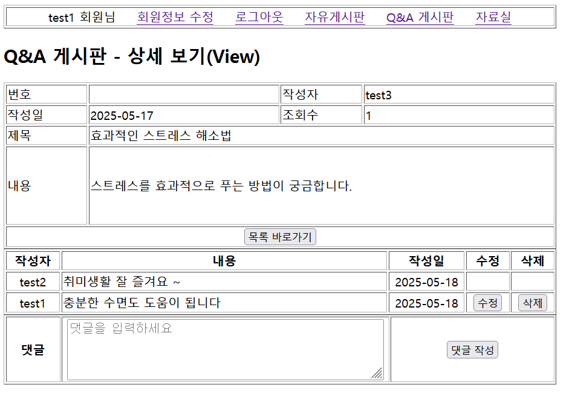

# 📌 회원제 게시판 프로젝트 (JSP / Servlet)

> JSP와 Servlet을 기반으로 구현한 커뮤니티 웹사이트입니다.  
> **회원가입, 로그인, 게시판, 댓글, 파일 업로드(자료실)** 등 웹 서비스에서 자주 사용되는 핵심 기능을 직접 설계하고 구현하였습니다.  
> 프레임워크 없이 HTTP 요청/응답 흐름, 세션/쿠키 관리, 파일 업로드 등 웹 애플리케이션의 핵심 동작 원리를 이해하고자 한 프로젝트입니다.
---

## 💻 개발 기간

- **2024.11.14 ~ 2024.11.21 (7일)**
---

## 🛠 개발 환경

- ☕ **언어**: Java  
- 📦 **JDK 버전**: Java SE 21  
- 🖥️ **개발 도구(IDE)**: Eclipse IDE for Enterprise Java (JEE 2024-09)  
- 🎨 **프론트엔드**: JSP + JavaScript
- 🔧 **백엔드**: Servlet  
- 🗄️ **데이터베이스**: Oracle DB 11xe  
- 🚀 **서버**: Apache Tomcat 10.1  

---

| 기능명 | 설명 |
|--------|------|
| 🔐 로그인 | 세션 관리 + 아이디 저장(쿠키 사용) |
| 🆕 회원가입 | 아이디 중복 체크, 비밀번호 확인, 이메일 형식 검증 |
| ✏️ 회원정보 수정 | 아이디/이름 제외 정보 수정 가능 |
| 📝 자유게시판 | 회원만 글 작성 가능, 게시글 리스트/내용 보기 |
| 💬 Q&A 게시판 | 게시글 + 댓글 기능 구현 |
| 📎 자료실 | 파일 첨부 기능 (파일 업로드 구현) |
---

## 📸 구현 화면

	
🔐 로그인

  

	
🆕 회원가입

  
  

	
✍️ 회원정보 수정

  
  

	
📝 자유게시판

  
  
  

	
💬 Q&A 게시판

  
  

	
📎 자료실

  
  

---

## 🗂 ERD 

	
🗂 ERD

	
  

---

## 🤔어려웠던 점

>댓글 수정 기능 중 수정 버튼을 눌렀을 때 해당 댓글의 텍스트 영역을 활성화하는 부분에서 어려움을 겪었습니다.
>기존 데이터 불러오는 것은 문제없었지만, 사용자 인터랙션에 따라 동적으로 텍스트박스를 보여주고 수정할 수 있도록 만드는 로직 구현이 쉽지 않았습니다.

## ✅해결 방안

>학원 실습과 인터넷 검색을 통해 JavaScript 이벤트 처리와 JSP-Servlet 연동 방식을 익히고,
>수정 버튼 클릭 시 특정 댓글에만 수정 폼이 나타나고, 수정 완료 후 서버에 반영되도록 문제를 단계별로 해결했습니다.
>
>이를 통해 프론트엔드와 백엔드 간의 동적 UI 처리 및 데이터 흐름 관리에 대한 이해를 높일 수 있었습니다.

